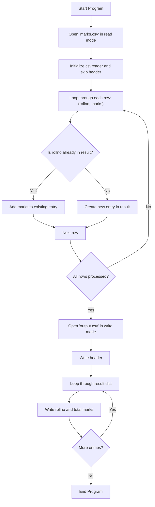

# 📝 Mini Project 07 - Marks Adding
> **Course**: [Thapar's Machine Learning Summer School, 2025](https://www.thaparsummerschool.com/)
> 
> **Student Name**: Ikansh Mahajan
>
> **Student Roll No.**: 102303754

## 🔎 Problem Statement
Given a CSV file containing roll nums and marks, add marks of each roll num and write the CSV to an output file.

## 🔬 Solution

## 🚀 How to Run Notebook
Click on the    button on top of the notebook to open it in Google Colab and experiment with my solution by copying it to your Drive.

## 🧾 Reflections
This assignment gave me hands-on exposure to using csv files in Python

## ⚠️ Report Issues
Create an issue ticket using the `Issues` section up above.
